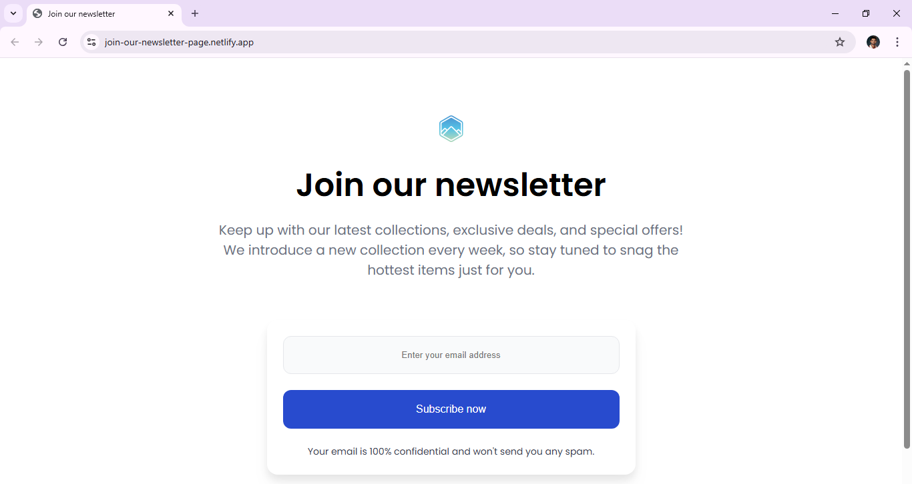

# 📩 Join Our Newsletter

Welcome to the **Join Our Newsletter** Page project!
A simple and responsive beginner-friendly web development project built with **HTML and CSS**, inspired by **DevChallenges**.

---

## 📌 Overview  
A clean and modern **newsletter subscription component**  with responsive design, stylish UI, and email input validation — built using pure**HTML and CSS**. This lightweight and visually appealing subscription form encourages users to join your newsletter.  

**The page includes:** 
- Create a minimal, visually attractive and modern design.
- Provide a clear input field and call-to-action button.
- Clearly communicates benefits to users.
- Ensure responsiveness for desktop and mobile screens.
- Maintain accessibility with semantic HTML. 

### Screenshot 📱
  

### Links 🔗
- Live Demo: [View Project](https://join-our-newsletter-page.netlify.app/)  
- Source Code: [GitHub Repository](https://github.com/sameer-srb/Join-Our-Newsletter)

---

## 🚀 My process

### Built with

-   
- 
- 

### What I learned 📑
During this project, I strengthened my skills in:
- Building a **subscription form layout** with reusable CSS styles.
- Styling input fields and buttons with **`box-shadows`, `padding`, and `border-radius**.
- Implementing **responsive component layout** using `@media` queries.
- Improving accessibility with proper form attributes like `required`.

### Useful resources 📚 
- [MDN Web Docs – HTML](https://developer.mozilla.org/en-US/docs/Web/HTML)  
- [MDN Web Docs – CSS](https://developer.mozilla.org/en-US/docs/Web/CSS) 
- [devChallenges](https://devchallenges.io/challenge/join-our-newsletter)  
- [Google Fonts (Popins)](https://fonts.google.com/specimen/Poppins)

---
## 🙏 Acknowledgments
Special thanks to **devChallenges** and **MDN Docs** for helpful resources during the development.

---

## 📬 Feedback
Suggestions or improvements welcome!  
Feel free to open an issue or reach out.

**Author :-**

 -  - 

Created by **SAMEER** - 2025
